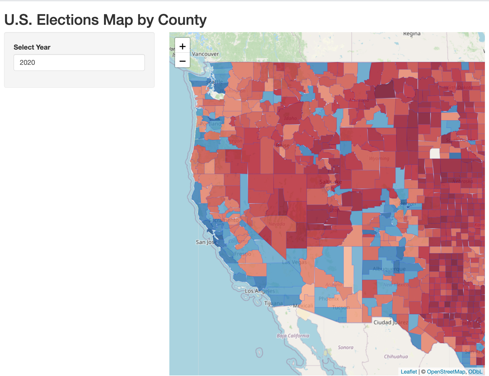

This repository contains a shiny app that visualizes the election outcomes for
the year selected in each county in the United States. A red shading indicates a 
Republican win and blue indicates a Democratic win.

## Data Set

MIT Election Data and Science Lab, 2018, "County Presidential Election Returns 2000-2020", 
https://doi.org/10.7910/DVN/VOQCHQ, Harvard Dataverse, V13, UNF:6:GILlTHRWH0LbH2TItBsb2w== [fileUNF]


## Running the app


To run the app in Rstudio, execute the following code in R:


```r
library(shiny)

# Run an app from a subdirectory in the repo

runGitHub(
  repo = "election-maps",
  username = "jazmmiine")
  
```


## Author 

Jazmine Gamboa

[jazmine-gamboa.quarto.pub](https://jazmine-gamboa.quarto.pub)